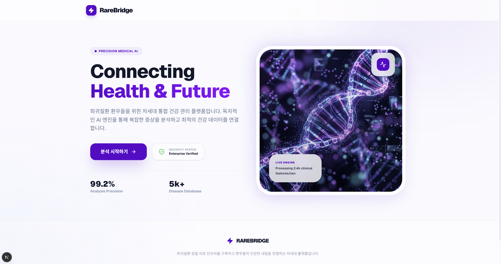

# 🌉 RareBridge

사용자가 입력한 증상을 HPO(Human Phenotype Ontology) 기반 데이터와 연결하여  
관련도 높은 희귀질환 후보를 제시하는 서비스입니다. 

--- 

## 1. ✨ 프로젝트 소개

RareBridge는 사용자가 입력한 증상 정보를 HPO 기반으로 표준화하고,  
이를 질환 데이터와 연결해 후보 질환을 확인할 수 있도록 설계한 프로젝트입니다.

자유 텍스트 또는 이미지 형태의 증상 입력을 바탕으로 증상을 구조화하고
질환 데이터와의 매칭 및 스코어링 과정을 거쳐 상위 희귀질환 후보 및 관련 정보를 제공합니다. 

### 주요 기능

- **증상 입력 및 HPO 변환**  
  사용자가 입력한 자유 텍스트 증상과 이미지를 분석하여 HPO 표준 용어 및 코드로 변환합니다.

- **질환 스코어링 및 후보 탐색**  
  변환된 HPO 데이터를 기반으로 희귀질환 데이터베이스와 매칭하고, 관련도 높은 질환 후보를 점수화합니다.

- **Top 5 희귀질환 후보 제시**  
  스코어링 결과를 바탕으로 상위 5개의 희귀질환 후보를 추천합니다.

- **질환 설명 및 주요 정보 제공**  
  질환명, ORPHA 코드, 설명, 일치도 등 핵심 정보를 결과 화면에서 확인할 수 있습니다.

--- 

## 2. 🎯 문제 정의 및 목표

희귀질환은 증상이 뚜렷하지 않고 유사 질환과 겹치는 경우가 많아 초기 판단이 어렵습니다.  

따라서 증상 정보를 질환 데이터와 연결하는 체계적인 탐색 지원 도구가 필요합니다.

RareBridge는 이러한 문제를 해결하기 위해 다음 기능을 목표로 구현했습니다.

- 자유 텍스트 및 이미지 기반 증상 입력 지원
- 입력 증상의 HPO(Human Phenotype Ontology) 기반 표준화
- 질환 데이터와의 매칭 및 스코어링
- 관련도 높은 희귀질환 후보 및 핵심 정보 제공

사용자가 복잡한 의학 용어 없이도 희귀질환 후보를 보다 직관적으로 확인할 수 있도록 지원하는 것이 프로젝트의 핵심 목표입니다.

--- 

## 3. 🛠 기술 스택

### Frontend


### Backend


### Database


### AI / External Service


### Deployment


### Collaboration


--- 

## 4. 🏗 시스템 아키텍처

RareBridge의 시스템 아키텍처는 크게 **웹 클라이언트, API 서버, 데이터베이스, 외부 서비스**의 네 영역으로 구성됩니다.

### 1) 웹 클라이언트
웹 클라이언트는 **Next.js 기반**으로 구현되었으며,  
기능 단위로 api / model / ui를 분리한 구조로 설계했습니다.
사용자는 이 영역에서 증상을 입력하고 결과를 확인합니다. 

- **ui**: 사용자 화면을 구성하는 컴포넌트 영역  
- **api**: 백엔드와 통신하는 요청 로직 분리  
- **model**: 타입 정의 및 데이터 구조 관리  

### 2) API 서버
API 서버는 사용자 요청을 받아 핵심 로직을 처리하는 영역입니다.  
구조적으로는 **API, Service, Repository, Schema**로 나누어 볼 수 있으며,  
핵심 설계 방식으로 **Service Layer Pattern**과 **Repository Pattern**을 적용했습니다.

- **API(Controller)**: 요청 수신 및 응답 반환
- **Service Layer**: 증상 분석, HPO 변환, 질환 추천 등 비즈니스 로직 처리
- **Repository**: 데이터베이스 조회 및 데이터 접근 로직 분리
- **Schema**: 요청/응답 데이터 구조 정의 및 검증

### 3) 데이터베이스
데이터베이스는 **질병 · 증상 · HPO** 정보를 저장하는 영역입니다.  
공개 의료 데이터셋 기반 조회 구조를 갖추고 있으며 
질환 정보와 HPO 용어, 질환-증상 매핑 정보를 **정규화된 테이블 구조**로 관리합니다.

### 4) 외부 서비스
**Gemini API**를 연동하여 자연어 기반 증상 해석과 HPO 코드 변환을 지원합니다.

사용자가 웹에서 증상을 입력하면 백엔드 API 서버가 이를 분석하고, 
데이터베이스와 외부 서비스를 활용해 최종적으로 관련도 높은 희귀질환 후보를 다시 사용자에게 제공하는 구조입니다.

--- 

## 5. 🔄 주요 동작 흐름

```text
사용자 증상 입력
→ AI 기반 증상 분석
→ HPO 코드 변환
→ 질환 데이터 조회
→ 스코어링
→ Top 5 희귀질환 추천
→ 결과 제공
```

---  

## 6. 🎥 시연 영상

주요 기능과 전체 동작 흐름은 아래 이미지를 클릭해 확인할 수 있습니다. 

<p align="center">
  <a href="https://drive.google.com/file/d/1nCF6sr1GR9A5PBiQQLx_k46Nz5IhZ--d/view?usp=drive_link">
    
  </a>
</p>

<p align="center">
  이미지를 클릭하면 시연 영상으로 이동합니다.
</p>